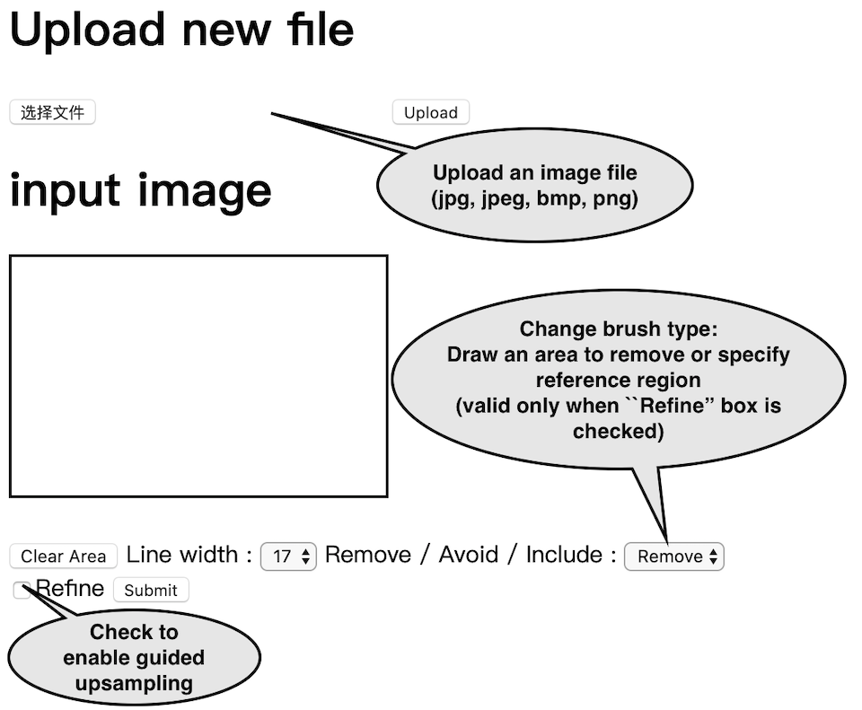

# ProFill: High-Resolution Image Inpainting with Iterative Confidence Feedback and Guided Upsampling, ECCV 2020

Yu Zeng$^1$, Zhe Lin$^2$, Jimei Yang$^2$, Jianming Zhang$^2$, Eli Shechtman$^2$, Huchuan Lu$^1$

1 Dalian University of Technology, 

2 Adobe Research

[Results](#synthetic-samples) | [Web App](#web-app) | [REST API](#api) | [Paper](https://arxiv.org/pdf/2005.11742.pdf) | [Supplementary Material](#supplementary-material) | [Comparison](#comparison)

## High-resolution results (≥1024)
[Synthetic samples](#synthetic-samples) | [Removing real objects](#removing-real-objects)

### Synthetic samples


### Removing real objects


## Web APP
[http://47.57.135.203:2333/](http://47.57.135.203:2333/)

Usage:


Effect of specifying the include or avoid region:


## API
http://47.57.135.203:2333/api

```python
mode_img = img.mode
mode_msk = mask.mode

W, H = img.size
str_img = img.tobytes().decode("latin1")
str_msk = mask.tobytes().decode("latin1")

data = {'str_img': str_img, 'str_msk': str_msk, 'width':W, 'height':H, 
        'mode_img':mode_img, 'mode_msk':mode_msk}
        
# Enable upsample
#data = {'str_img': str_img, 'str_msk': str_msk, 'str_include':None, 'str_avoid':str_avoid, 'width':W, 'height':H, #'mode_img':mode_img, 'mode_msk':mode_msk, 'is_refine': True}

r = requests.post('http://47.57.135.203:2333/api', json=data)
```

[download python example](https://maildluteducn-my.sharepoint.com/:u:/g/personal/zengyu_mail_dlut_edu_cn/ETN_-k4fwkBLtcsy2qY8OFIBWdjHU27cnO7sCjfRrmC3VA?download=1)
 
## Supplementary Material
* [PDF](https://maildluteducn-my.sharepoint.com/:b:/g/personal/zengyu_mail_dlut_edu_cn/EbQvnHMGlmFIoS2qmNnwOdwBgpIrTS26NNrFy8JB9jeS_Q?e=Vcy6mj)

## Comparison
* [Visual comparison](https://github.com/zengxianyu/Inpaint_Comparison/blob/master/README.md) of ours (ProFill and +Upsample) with [HiFill](https://arxiv.org/abs/2005.09704)
* [Visual comparison](https://zengxianyu.github.io/iic/vis) with state-of-the-art methods
* [Quantitative comparison with more methods](https://zengxianyu.github.io/iic/qcmp)
